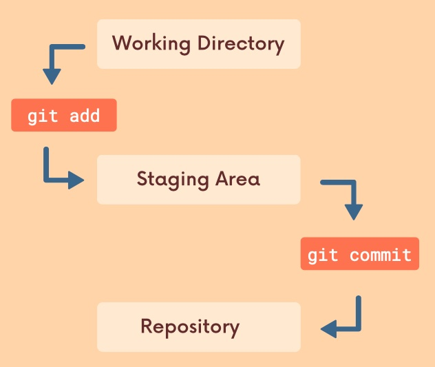

# Adding & Committing



Create a new project/repository:
```shell
~/workspace/git 
mkdir basics

~/workspace/git 
cd basics 

workspace/git/basics 
git init
Initialized empty Git repository in /Users/davidainslie/workspace/git/basics/.git/

basics on  main
ls -las
total 0
0 drwxr-xr-x  9 davidainslie  staff  288 Apr 11 16:44 .git
```

## Staging Changes with Git Add

Say we made changes to 7 files:
- 1 file deleted
- 2 files amended
- 4 new files

and we want to commit those first 3 files and then the remaining 4 new files - we will perform 2 `git add` along with 2 `git commit`.

So let's do some `adding` by first `doing stuff`:
```shell
touch outline.txt

vim outline.txt
```

where we write the following text within this new file:
```text
Chapter 1 
- We meet Nick, Tom, Daisy and Jordan
```

So what does Git think of this?
```shell
git status
On branch main

No commits yet

Untracked files:
  (use "git add <file>..." to include in what will be committed)
        outline.txt

nothing added to commit but untracked files present (use "git add" to track)
```

Create another file and again include text:
```shell
touch characters.txt
```

Now what does Git say?
```shell
git status
On branch main

No commits yet

Untracked files:
  (use "git add <file>..." to include in what will be committed)
        characters.txt
        outline.txt

nothing added to commit but untracked files present (use "git add" to track)
```

Use `git add` to add specific files to the `staging` area.
Separate files with spaces to add multiple files at once e.g.
```shell
git add file1 file2
```

Let's first add `characters`:
```shell
git add characters.txt 

git status
On branch main

No commits yet

Changes to be committed:
  (use "git rm --cached <file>..." to unstage)
        new file:   characters.txt

Untracked files:
  (use "git add <file>..." to include in what will be committed)
        outline.txt
```

Now the other:
```shell
git add outline.txt 

git status
On branch main

No commits yet

Changes to be committed:
  (use "git rm --cached <file>..." to unstage)
        new file:   characters.txt
        new file:   outline.txt
```

## Git Commit

We use `git commit` to actually commit changes from the staging area (to the repository).

Note that if your just provide `git commit`, then the default editor will open expecting a commit message.

```shell
git commit -m "Start work outline and main characters"
[main (root-commit) f33f144] Start work outline and main characters
 2 files changed, 9 insertions(+)
 create mode 100644 characters.txt
 create mode 100644 outline.txt
```

## Git Log

Let's do some more work.
```shell
vim chapter1.txt
```

and we enter:
```text
Chapter 1 
 
blah blah blah
```

Let's change outline.txt `Jordan` to lower case i.e. `jordan`:
```shell
git status
On branch main
Changes not staged for commit:
  (use "git add <file>..." to update what will be committed)
  (use "git restore <file>..." to discard changes in working directory)
        modified:   outline.txt

Untracked files:
  (use "git add <file>..." to include in what will be committed)
        chapter1.txt
```

Add both files:
```shell
git add outline.txt chapter1.txt

git status
On branch main
Changes to be committed:
  (use "git restore --staged <file>..." to unstage)
        new file:   chapter1.txt
        modified:   outline.txt
```

```shell
git commit -m "Begin work on chapter 1"
[main 4f5d355] Begin work on chapter 1
 2 files changed, 13 insertions(+), 1 deletion(-)
 create mode 100644 chapter1.txt
```

Let's now get a `log` of the commits:
```shell
git log
commit 4f5d35582f26c5c25f83ff0545d003fd7d87fa0c (HEAD -> main)
Author: David Ainslie <dainslie@gmail.com>
Date:   Sun Apr 11 18:16:35 2021 +0100

    Begin work on chapter 1

commit f33f14434e9863250ce8031e221775148888f532
Author: David Ainslie <dainslie@gmail.com>
Date:   Sun Apr 11 18:02:31 2021 +0100

    Start work outline and main characters
```

Let's do more work, we update the outline and chapter1:
```shell
git status      
On branch main
Changes not staged for commit:
  (use "git add <file>..." to update what will be committed)
  (use "git restore <file>..." to discard changes in working directory)
        modified:   chapter1.txt
        modified:   outline.txt

no changes added to commit (use "git add" and/or "git commit -a")
```

Use `git add .` to stage all changes at once:
```shell
git add .

git status
On branch main
Changes to be committed:
  (use "git restore --staged <file>..." to unstage)
        modified:   chapter1.txt
        modified:   outline.txt
```

and commit:
```shell
git commit -m "Finished chapter 1"
[main d9125ee] Finished chapter 1
 2 files changed, 8 insertions(+)
```

```shell
git log
commit d9125eefb917a51ac60efc9969f2c023712a3975 (HEAD -> main)
Author: David Ainslie <dainslie@gmail.com>
Date:   Sun Apr 11 18:27:06 2021 +0100

    Finished chapter 1

commit 4f5d35582f26c5c25f83ff0545d003fd7d87fa0c
Author: David Ainslie <dainslie@gmail.com>
Date:   Sun Apr 11 18:16:35 2021 +0100

    Begin work on chapter 1

commit f33f14434e9863250ce8031e221775148888f532
Author: David Ainslie <dainslie@gmail.com>
Date:   Sun Apr 11 18:02:31 2021 +0100

    Start work outline and main characters
```

Let's go back to the outline to include Chapter 2, and cut out half of the chapter 1 file into a new chapter 2:
```shell
git status
On branch main
Changes not staged for commit:
  (use "git add <file>..." to update what will be committed)
  (use "git restore <file>..." to discard changes in working directory)
        modified:   chapter1.txt
        modified:   outline.txt

Untracked files:
  (use "git add <file>..." to include in what will be committed)
        chapter2.txt

no changes added to commit (use "git add" and/or "git commit -a")
```

Ok, add them add:
```shell

```