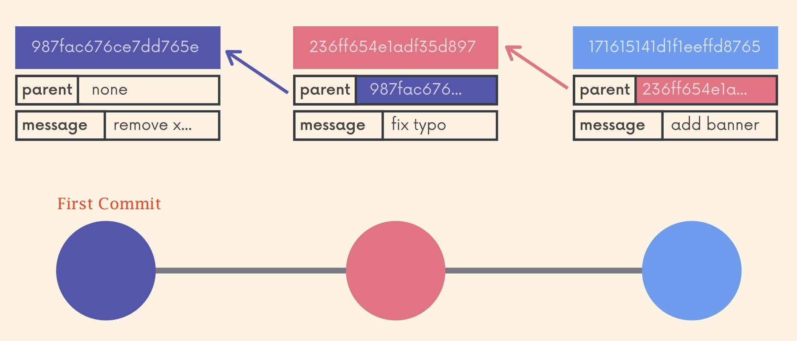
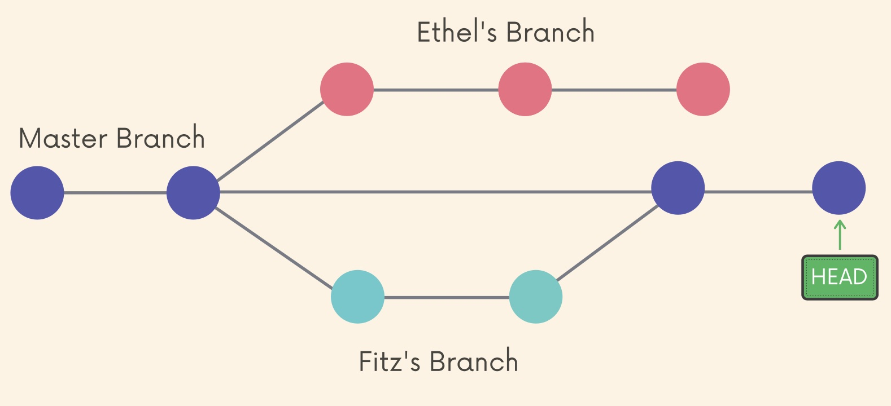
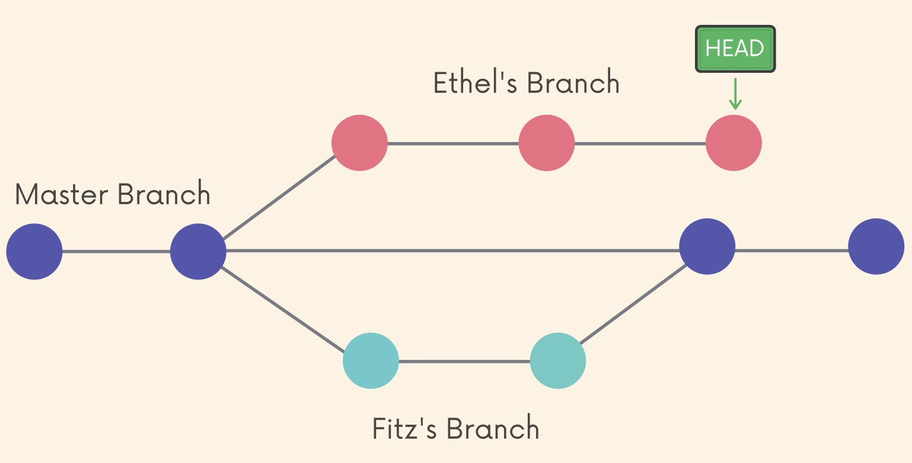
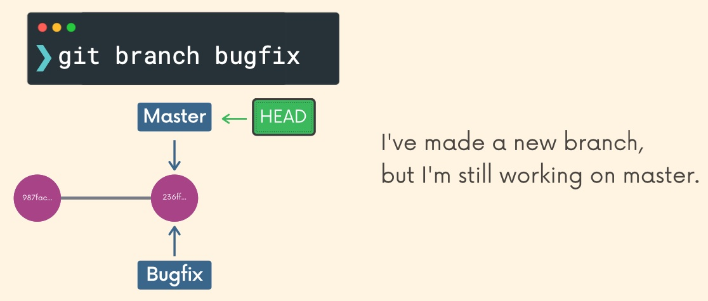

# Branches



The `main` branch doesn't do anything special.
Upon creating a repository, you have to start on a branch and so one is automatically created and this will be the `main` branch by default, but it doesn't have to stay that way.

## HEAD

```shell
git log --oneline
f27630c (HEAD -> main) Introduce .gitignore
9b4a486 Only commit 1 file instead of 2
a4b7a7e Add titanic images
...
```
or
```shell
git log
commit f27630c3d905634a3e3827f2993d2e2511297963 (HEAD -> main)
Author: David Ainslie <dainslie@gmail.com>
Date:   Sat Apr 17 16:32:31 2021 +0100

    Introduce .gitignore
...
```

`HEAD` is simply a pointer that refers to the current `location` in your repository.
It points to a particular branch reference.

When working on a repository, the HEAD point somewhere at any one time.
When we clone we will be on `main` and that is where HEAD points.
Then we might switch (get checkout) to a branch and that is where HEAD points:



and we switch to a branch:



## Creating and Switching Branches



As an example, we'll work in a new repository:

```shell
mkdir road-trip-play-list

cd road-trip-play-list 

git init
```

We'll create a new file using a `Here document`: 

```shell
> cat > playlist.txt <<EOF
> SONG - ARTIST
> =============
> EOF
```

```shell
git add playlist.txt 

git commit -m "Add new playlist header"
```

We'll add some songs:
```shell
> cat >> playlist.txt <<EOF
> SOS - ABBA
> One of Us - ABBA
> EOF
```

```shell
git add playlist.txt 

git commit -m "Add 2 ABBA songs"
```

Create a new branch (switching to it at the same time, and we'll see HEAD has moved but still at the same commit):
```shell
git checkout -b oldies
Switched to a new branch 'oldies'

git log --oneline
bf88e1b (HEAD -> oldies, main) Add 2 ABBA songs
9287a04 Add new playlist header
```

However, in this case, `switch` is preferred over `checkout` e.g.
```shell
git switch main
Switched to branch 'main'

git switch oldies
Switched to branch 'oldies'
```

Ok, let's add songs on this new branch:
```shell
> cat >> playlist.txt <<EOF
> He Stopped Loving Her Today - George Jones
> The Race is on - George Jones
> EOF
```

```shell
git add playlist.txt 

git commit -m "Add two songs by George Jones"
```

Now we'll see `main` in left behind as `HEAD` tracks the latest commit:
```shell
git log --oneline
97f3a1d (HEAD -> oldies) Add two songs by George Jones
bf88e1b (main) Add 2 ABBA songs
9287a04 Add new playlist header
```

## Add and Commit at the Same Time

On the `oldies` branch we add two more songs:
```shell
> cat >> playlist.txt <<EOF
> My Sweet Lord - George Harrison
> What is Life - George Harrison
> EOF
```

Then add and commit at the same time (which can be done for any non-new files):
```shell
git commit -am "Add 2 George Harrison songs"
```

## Switching Branches

Where are we?
```shell
git log --oneline
d3a090a (HEAD -> oldies) Add 2 George Harrison songs
97f3a1d Add two songs by George Jones
bf88e1b (main) Add 2 ABBA songs
9287a04 Add new playlist header
```

`HEAD` is pointing at `oldies`. Make a new `georges` branch:
```shell
git branch georges

git log --oneline 
d3a090a (HEAD -> oldies, georges) Add 2 George Harrison songs
97f3a1d Add two songs by George Jones
bf88e1b (main) Add 2 ABBA songs
9287a04 Add new playlist header
```

We see the new branch, though HEAD still points at `oldies` - Let's switch:
```shell
git switch georges
Switched to branch 'georges'

git log --oneline
d3a090a (HEAD -> georges, oldies) Add 2 George Harrison songs
97f3a1d Add two songs by George Jones
bf88e1b (main) Add 2 ABBA songs
9287a04 Add new playlist header
```

`HEAD` now points at `georges` - Let's switch back to `oldies`:
```shell
git switch oldies
Switched to branch 'oldies'

git log --oneline
d3a090a (HEAD -> oldies, georges) Add 2 George Harrison songs
97f3a1d Add two songs by George Jones
bf88e1b (main) Add 2 ABBA songs
9287a04 Add new playlist header
```

And indeed, `HEAD` points back a `oldies`.

## Create and Switch at the Same Time

```shell
git switch -c <branch-name>
```
where `-c` stands for "create".

If you were to use `checkout` then:
````shell
git checkout -b <branch-name>
````

## Renaming Branches

Create a branch, then on said branch we can rename:
```shell
git switch -c to-rename
Switched to a new branch 'to-rename'

git branch -m new-name

git log --oneline
d3a090a (HEAD -> new-name, oldies, georges) Add 2 George Harrison songs
```

## How Git Stores HEAD and Branches

Within the `.git` directory there is a file named `HEAD`:
```shell
road-trip-play-list on  new-name 
cat .git/HEAD
ref: refs/heads/new-name
```

```shell
road-trip-play-list on  new-name 
git switch main
Switched to branch 'main'

road-trip-play-list on  main 
cat .git/HEAD  
ref: refs/heads/main
```

And what is `refs/heads/main` and `refs/heads/new-name` etc.?
There is a file such as `main` for every branch under the directory `refs/heads` and each file has the latest commit for its branch:
```shell
ls -las .git/refs/heads
total 32
0 drwxr-xr-x  6 davidainslie  staff  192 Apr 24 21:56 .
0 drwxr-xr-x  4 davidainslie  staff  128 Apr 19 22:24 ..
8 -rw-r--r--  1 davidainslie  staff   41 Apr 23 21:47 georges
8 -rw-r--r--  1 davidainslie  staff   41 Apr 19 22:33 main
8 -rw-r--r--  1 davidainslie  staff   41 Apr 24 21:56 new-name
8 -rw-r--r--  1 davidainslie  staff   41 Apr 23 21:43 oldies
```

```shell
cat .git/refs/heads/main
bf88e1b1e248b595589bed70de6ab5f8e2f232cf
```

Double check that commit:
```shell
git log --oneline
bf88e1b (HEAD -> main) Add 2 ABBA songs
9287a04 Add new playlist header
```