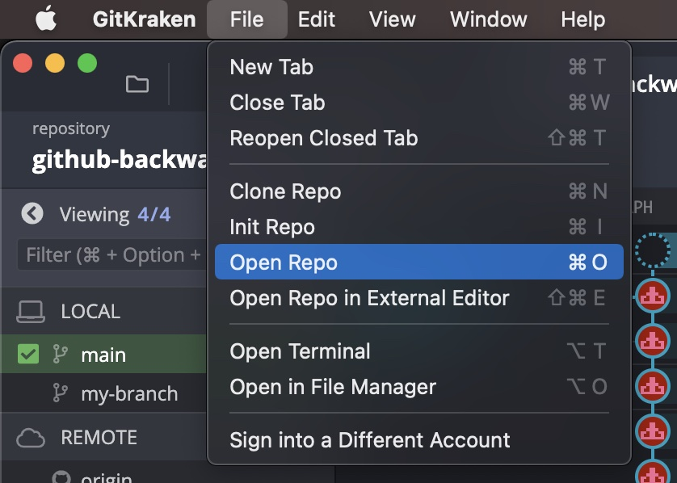
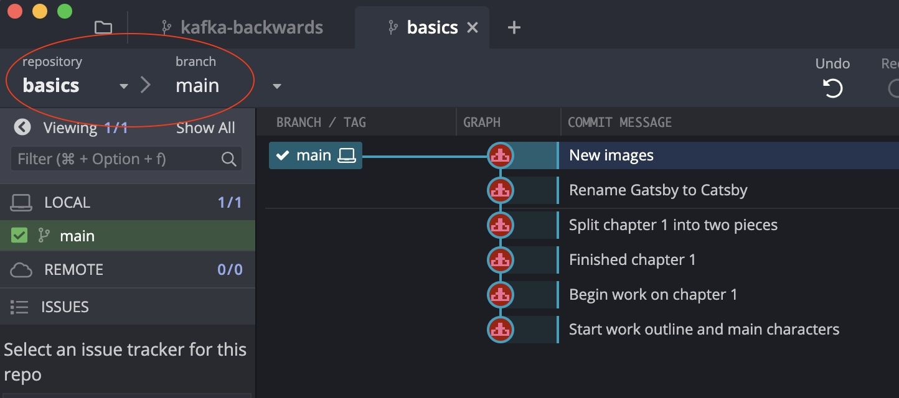
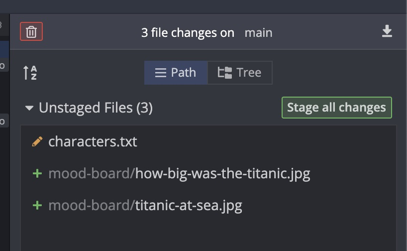
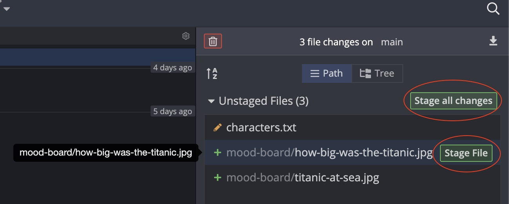
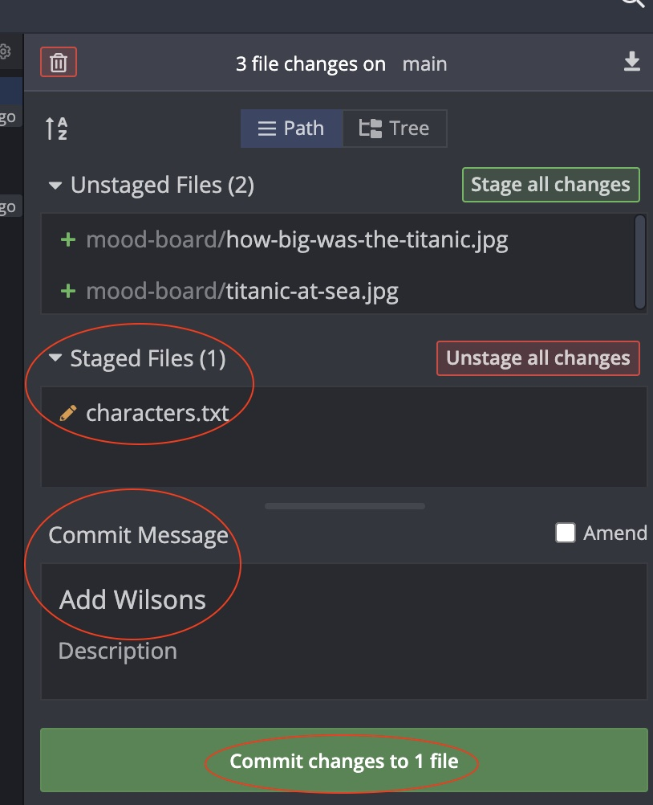
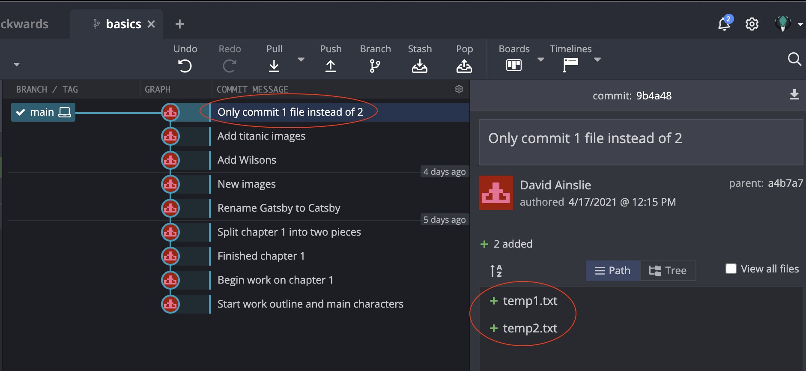

# Committing

Some useful resources for our learning:
- [Faker](https://github.com/marak/Faker.js/)
- [TensorFlow](https://github.com/tensorflow/tensorflow)
- [Signal](https://github.com/signalapp/Signal-Android)
- [Git Ignore](https://www.toptal.com/developers/gitignore) and [GitHub Ignore](https://docs.github.com/en/github/getting-started-with-github/ignoring-files)

## Atomic Commits

When possible, a commit should encompass a single feature, change of fix.
In other words, try to `keep each commit focused on a single thing`.

This make it much easier to undo or rollback changes later on.
It also makes your code or project easier to review.

In our basics repository, create a folder and add some images:
```shell
mkdir mood-board

cd mood-board

wget https://allthatsinteresting.com/wordpress/wp-content/uploads/2019/03/josephine-baker-ostrich.jpg

wget https://allthatsinteresting.com/wordpress/wp-content/uploads/2019/03/1920s-women-convertibles-furs.jpg

wget https://allthatsinteresting.com/wordpress/wp-content/uploads/2019/03/charlie-chaplin-tramp.jpg
```

```shell
cd ..

git status
On branch main
Untracked files:
  (use "git add <file>..." to include in what will be committed)
        mood-board/
```

Let's change across our text files "Gatsby" with "Catsby":
```shell
find . -name '*.txt' -print0 | xargs -0 sed -i "" "s/Gatsby/Catsby/g"
```

Now we have:
```shell
git status
On branch main
Changes not staged for commit:
  (use "git add <file>..." to update what will be committed)
  (use "git restore <file>..." to discard changes in working directory)
        modified:   chapter2.txt
        modified:   characters.txt
        modified:   outline.txt

Untracked files:
  (use "git add <file>..." to include in what will be committed)
        mood-board/
```

If we were to add all as one single commit, this wouldn't really follow the best practice of `atomic commits`.

Let's split the commits:
- A commit for changing `Gatsby` to `Catsby`
- Another commit for adding new images

```shell
git add chapter2.txt characters.txt outline.txt

git commit -m "Rename Gatsby to Catsby"
```

```shell
git add mood-board/

git commit -m "New images"
```

## Commit Messages - Present or Past Tense

It is recommended to use `present tense imperative style` messages.

e.g.
- GOOD: "Make xyz do frotz"
- BAD: "Makes xyz do fotz" or "I changed xyz to do frotz"

## Editor

The default git editor is `vi / vim` but this can be changed e.g. to Visual Studio Code:
```shell
git config --global code.editor "code --wait"
```

## Log

```shell
shopping on  main 
git log --oneline
38a2c86 (HEAD -> main, my-branch) Resolved merge conflict
27a3028 Done on main
b6842ae Done on my-branch
03c9aed Add items needed to grow potatoes
95b1d05 Add items needed for garden box
8b22283 Add ingredients for tomato soup
3001792 Create yard and groceries lists
```

## GUI - GitKraken

Let's open the `basics` repository we've been locally working with:





Update the `characters.txt` file (ready for a new commit).
And add two more images to our `mood board`:

```shell
wget -O ./mood-board/how-big-was-the-titanic.jpg https://allthatsinteresting.com/wordpress/wp-content/uploads/2021/02/how-big-was-the-titanic.jpg

wget -O ./mood-board/titanic-at-sea.jpg https://allthatsinteresting.com/wordpress/wp-content/uploads/2021/02/titanic-at-sea.jpg
```

Now take a look at the GUI (in top right) and then `click` to view the changes:




We can stage all these changes, or individually if we hover over a particular change:



Let's stage and commit the change to `characters.txt` by first clicking on `stage file`:



## Amending Commits

(Or fixing mistakes)

NOTE - this only works if you make a mistake 1 commit ago e.g. you can't correct spelling from 2 commits in the past.

Suppose you just made a commit and then realised you forgot to include a file.
Or maybe you made a typo in the commit message that you want to correct.
Rather than making a brand new separate commit, you can `redo` the previous commit using the `--amend` option.

e.g.
```shell
git commit -m "Some commit"
git add forgotten-file
git commit --amend
```

So I create 2 files `temp1.txt` and `temp2.txt` but accidentally only commit 1.
When I follow the above I still end up with only 1 commit but the 2 files are included:



## Ignoring Files

We can tell Git which files and directories to ignore in a given repository using a `.gitignore` file.
This is useful for files you know you **never** want to commit, including:
- Secrets, API keys, credentials etc.
- Operating system files (.DS_Store on Mac)
- Log files
- Dependencies and packages

So, we create a file named `.gitignore` in the **root** of a repository.
Inside the file we can write patterns to tell Git which files and folders to ignore:
- Ignore files named .DS_Store
  - .DS_Store
- Ignore an entire directory
  - folderName/
- Ignore any files with .log extension
  - *.log
    
To demo this we'll upgrade our `basics` repository to `node` (doesn't matter than this doesn't make much sense for a repository that has started out as a Gatsby book):
```shell
npm init
```

```shell
touch index.js

touch secrets.txt
```

We don't want to commit `secrets.txt`.
The same is when we for example have the following dependencies installed under `node_modules``:
```shell
npm install react
```

```shell
basics on  main [?] is 📦 v1.0.0 
➜ git status
On branch main
Untracked files:
  (use "git add <file>..." to include in what will be committed)
        index.js
        node_modules/
        package-lock.json
        package.json
        secrets.txt
```

Let's add the necessaries to `.gitignore`:

```gitignore
.DS_Store
secrets.txt
node_modules/
```
and those files will magically be ignored by Git:
```shell
git status
On branch main
Untracked files:
  (use "git add <file>..." to include in what will be committed)
        .gitignore
        index.js
        package-lock.json
        package.json
```

```shell
git add .

git commit -m "Introduce .gitignore"
```