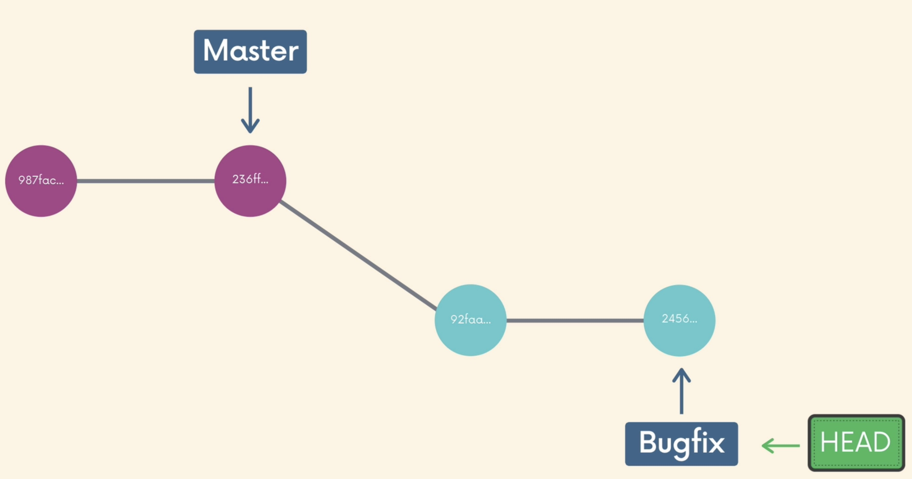
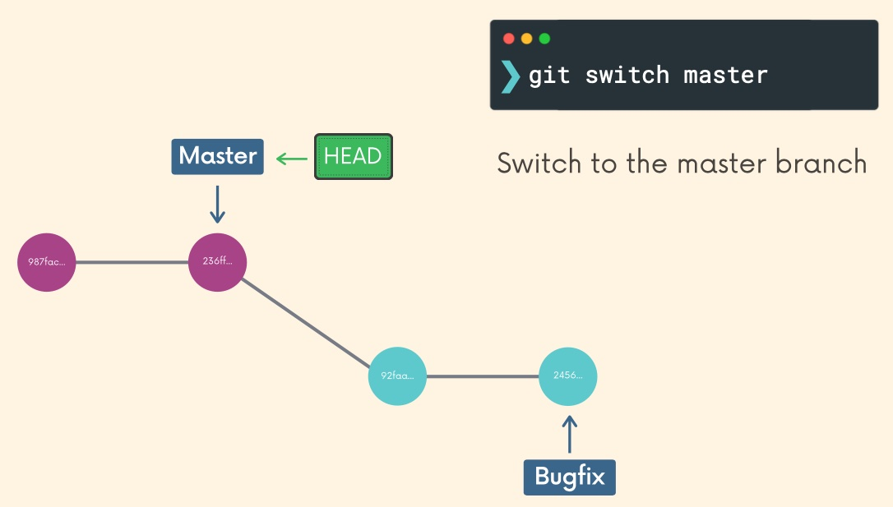
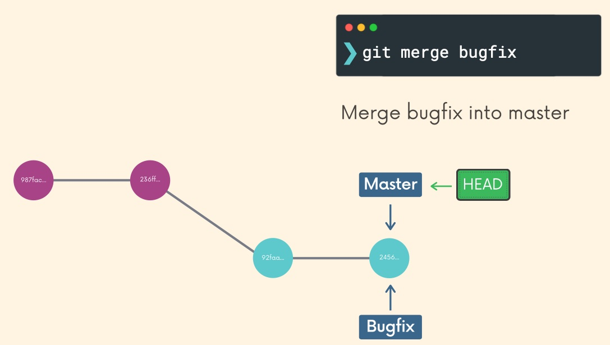

# Merging

- We merge branches, not specific commits
- We always merge to the current `HEAD` branch

Perform a `merge` with these two basic steps:
- Switch to or checkout the branch you want to merge the changes into (the receiving branch)
- Use the `git merge` command to merge changes from a specific branch into the current branch

## Fast Forward Merge

As an example, to merge the bugfix branch into main:
```shell
git switch main

git merge bugfix
```

i.e. we want to merge the following:



So perform the first step i.e.
```shell
git switch main
```



Then we:
```shell
git merge bugfix
```



The above is called a **Fast Forward Merge**, because main simply caught up on the commits from bugfix.

So let's actually perform a merge:
```shell
➜ git branch -v
  harry 67dcd21 Add harry's stag patronus
* lily  8530ca3 Add lily's doe patronus
  main  11feb7c Add empty patronus file

➜ git switch main
Switched to branch 'main'

➜ git merge lily
Updating 11feb7c..8530ca3
Fast-forward
 patronus.txt | 16 ++++++++++++++++
 1 file changed, 16 insertions(+)
```