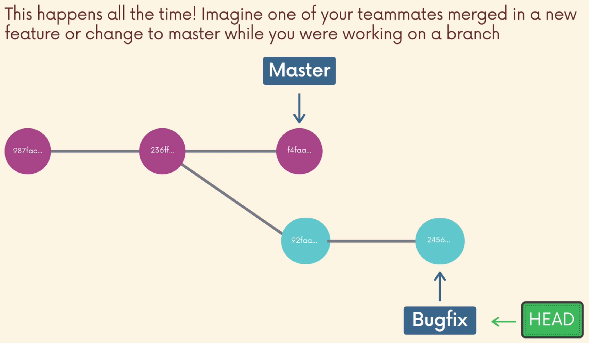
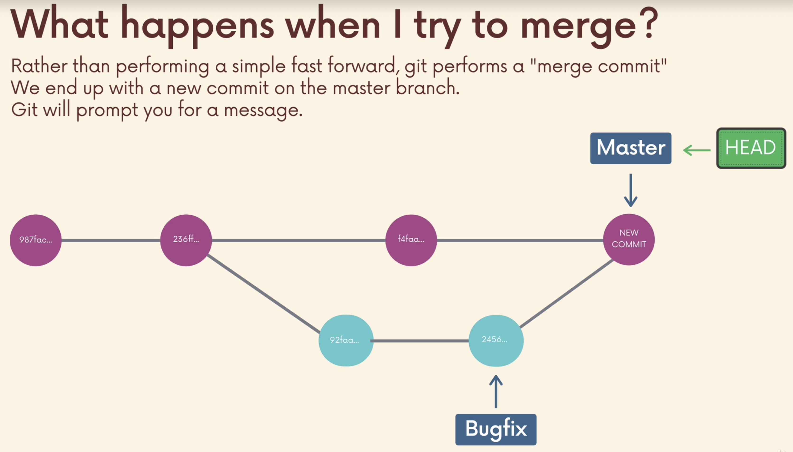
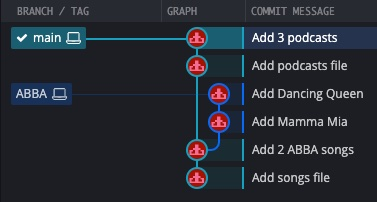
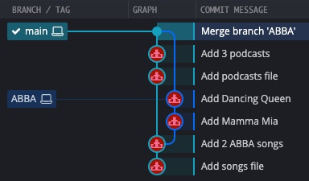

# Merging

- We merge branches, not specific commits
- We always merge to the current `HEAD` branch

Perform a `merge` with these two basic steps:
- Switch to or checkout the branch you want to merge the changes into (the receiving branch)
- Use the `git merge` command to merge changes from a specific branch into the current branch

## Fast Forward Merge

As an example, to merge the bugfix branch into main:
```shell
git switch main

git merge bugfix
```

i.e. we want to merge the following:


So perform the first step i.e.
```shell
git switch main
```


Then we:
```shell
git merge bugfix
```


The above is called a **Fast Forward Merge**, because main simply caught up on the commits from bugfix.

So let's actually perform a merge:
```shell
➜ git branch -v
  harry 67dcd21 Add harry's stag patronus
* lily  8530ca3 Add lily's doe patronus
  main  11feb7c Add empty patronus file

➜ git switch main
Switched to branch 'main'

➜ git merge lily
Updating 11feb7c..8530ca3
Fast-forward
 patronus.txt | 16 ++++++++++++++++
 1 file changed, 16 insertions(+)
```

## What if we add a commit to main while on a branch?





The `new commit` now has two parents, unlike most others such as a fast-forward commit.

Example:
```shell
mkdir playlist

cd playlist

git init

touch songs.txt

git add songs.txt

git commit -m "Add songs file"
```

Let's add 2 songs to our file:
```shell
vim songs.txt
```

```text
SOS - ABBA
One Of Us - ABBA
```

```shell
git add songs.txt
git commit -m "Add 2 ABBA songs"
```

Create new branch and add more songs:
```shell
git checkout -b ABBA

echo "Mamma Mia - ABBA" >> songs.txt
git add .
git commit -m "Add Mamma Mia"

echo "Dancing Queen - ABBA" >> songs.txt
git add .
git commit -m "Add Dancing Queen"
```

At this point, if we merge the `ABBA` branch into `main` it would just be a fast forward.

Instead, let's go back to `main` and do some more work.
At first we'll keep things simple and avoid conflicts by adding a new file:
```shell
git switch main

touch podcasts.txt
git add podcasts.txt
git commit -m "Add podcasts file"

cat <<EOF > podcasts.txt
The Lead
RadioLab
This American Life
EOF

git add podcasts.txt
git commit -m "Add 3 podcasts"
```

So now `main` has a commits that branch `ABBA` does not know about:



Let's merge the `ABBA` branch into `main` (and we'll see a merge commit occur):
```shell
git merge ABBA
```
our default editor will pop up - a commit (in this case a merge commit) needs a message, but as we did not provide one with `-m` the editor is presented e.g.
```text
Merge branch 'ABBA'
# Please enter a commit message to explain why this merge is necessary,
# especially if it merges an updated upstream into a topic branch
#
# Lines starting with '#' will be ignored, and an empty message aborts the commit
```
As we can see, git has suggested a commit message for us - "Merge branch 'ABBA'".
Upon "quitting" or "write and quitting" our new commit will take place:
```shell
Merge made by the 'recursive' strategy.
 songs.txt | 2 ++
 1 file changed, 2 insertions(+)
```



We can also see our new commit on the command line:
```shell
git log --oneline
b5118f1 (HEAD -> main) Merge branch 'ABBA'
9f586c3 Add 3 podcasts
aced795 Add podcasts file
6f466b3 (ABBA) Add Dancing Queen
19c4d9f Add Mamma Mia
41cfb09 Add 2 ABBA songs
b9d521b Add songs file
```